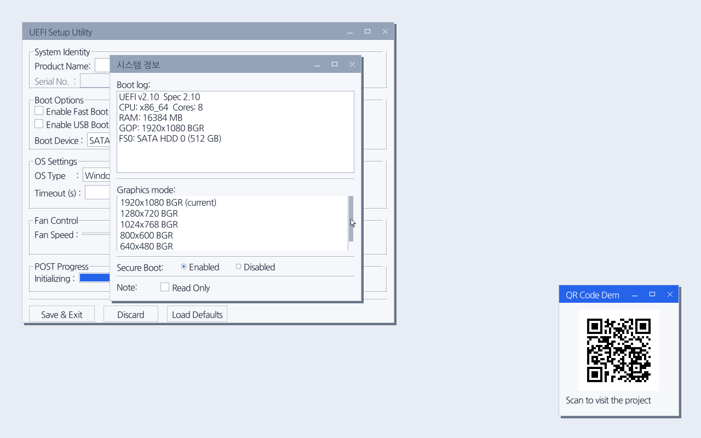
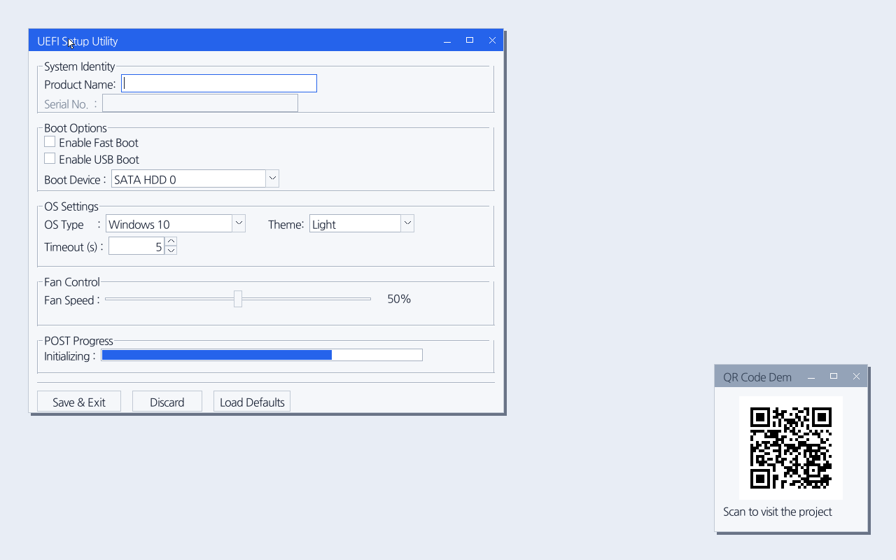
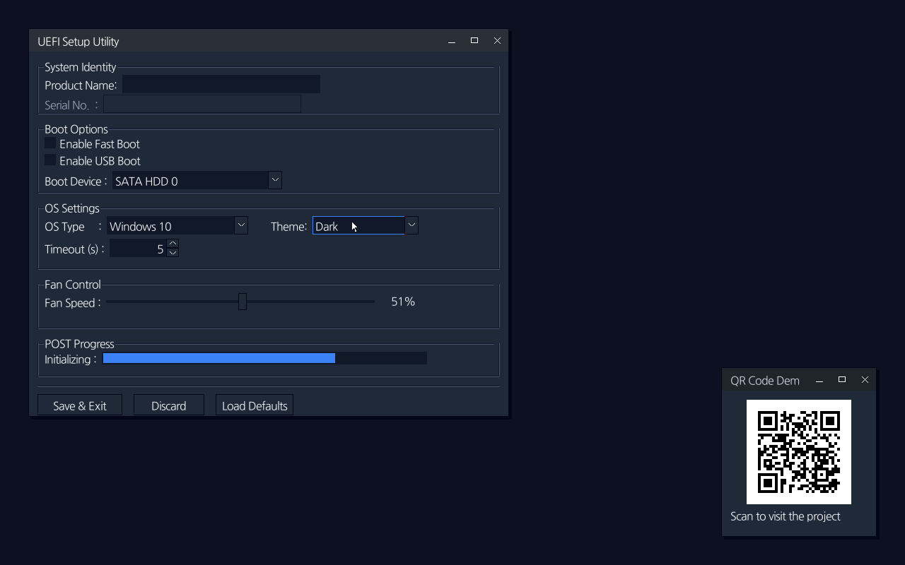
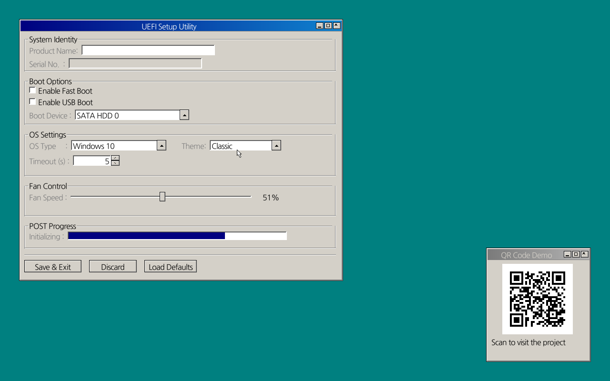

# uefi-wm

A small, `no_std` window manager and GUI toolkit that runs inside UEFI.

`uefi-wm` draws a floating desktop directly into a software framebuffer and
presents it through UEFI's Graphics Output Protocol (GOP). It includes windows,
14 widget types, mouse and keyboard input, callbacks, QR codes, and three themes.



The screenshot is the included demo running under QEMU/OVMF. It shows a
firmware-style settings app, system information, and the QR Code widget.

## Why this project?

UEFI applications normally start with a framebuffer and a keyboard protocol,
not a desktop UI. `uefi-wm` provides the layer in between, so a firmware tool can
open windows and controls instead of implementing drawing, focus, input, and
event dispatch from scratch.

The library is:

- `#![no_std]` and uses `alloc`;
- rendered entirely in software, with no operating system underneath;
- usable with GOP plus UEFI keyboard/pointer protocols;
- able to fall back to direct PS/2 mouse input on x86/x86_64;
- font-agnostic: the application supplies its own TTF bytes;
- dependency-free for QR encoding.

The repository contains two packages:

- `uefi-wm` at the workspace root: the reusable library (`uefi_wm` in Rust);
- `demo/`: a complete, non-publishable UEFI application named `uefi-gui`.

## Themes

The UI can switch themes at runtime without losing widget state, focus,
callbacks, or window order. `Theme::Light` is the default.

| Light | Dark | Classic |
|:---:|:---:|:---:|
| [](docs/assets/theme-light.png) | [](docs/assets/theme-dark.png) | [](docs/assets/theme-classic.png) |

Light and Dark use a roomier layout, flat controls, and a 32 px title bar.
Classic uses compact beveled controls and a 22 px title bar. The demo's Theme
combo box lets you try all three.

```rust,ignore
use uefi_wm::wm::Theme;

wm.set_theme(Theme::Dark);
```

## Try the demo

You need nightly Rust, the UEFI target, QEMU, and OVMF. On Debian or Ubuntu:

```bash
rustup toolchain install nightly
rustup component add rust-src llvm-tools-preview --toolchain nightly
rustup target add x86_64-unknown-uefi --toolchain nightly
sudo apt install qemu-system-x86 ovmf
```

Then launch the demo:

```bash
bash demo/qemu.sh
```

Press Escape to exit. You can also press `q` when no widget has keyboard focus.
Closing every window does not exit the application.

Useful launch modes:

```bash
bash demo/qemu.sh --vnc        # VNC on 127.0.0.1:5901
bash demo/qemu.sh --ps2        # exercise the direct PS/2 fallback
bash demo/qemu.sh --usb-tablet # use a firmware-supported USB tablet
```

The default virtual pointer is a virtio tablet. It works when OVMF includes a
tablet-capable VirtioInput driver. If pointer input does not work with your
firmware build, try `--ps2`.

VNC listens on loopback only. Use an authenticated tunnel if you need to reach
it from another machine.

## Use the library

The final UEFI binary—not this library—must provide the allocator, panic
handler, and logger. Keeping those runtime features out of the library avoids
duplicate symbols.

```toml
[dependencies]
uefi-wm = "0.1"
uefi = { version = "0.33", features = [
    "alloc", "global_allocator", "panic_handler", "logger"
] }
```

The basic flow is:

1. Open GOP and read its width, height, stride, and pixel format.
2. Create a software `Framebuffer`, `WindowManager`, and `InputDriver`.
3. Add windows and widgets.
4. Hand the GOP framebuffer to `WindowManager::run`.

```rust,ignore
use alloc::boxed::Box;
use uefi::boot;
use uefi::proto::console::gop::GraphicsOutput;
use uefi_wm::gfx::Framebuffer;
use uefi_wm::input::InputDriver;
use uefi_wm::wm::WindowManager;

static FONT: &[u8] = include_bytes!("../fonts/MyFont.ttf");

let handle = boot::get_handle_for_protocol::<GraphicsOutput>().unwrap();
let mut gop = boot::open_protocol_exclusive::<GraphicsOutput>(handle).unwrap();
let info = gop.current_mode_info();
let (mode_width, mode_height) = info.resolution();
let (width, height) = (mode_width as u32, mode_height as u32);

let mut framebuffer = Framebuffer::new(width, height, info.pixel_format())?;
let mut wm = WindowManager::new(width, height, FONT, 16.0);
let mut input = InputDriver::new(width, height);

let window = wm.open("Settings", 100, 80, 500, 300);
let slider = wm.add_slider(window, 0, 0, 220, "Volume: ", 0, 100, 50);
let progress = wm.add_progressbar(window, 0, 32, 220, "");

wm.set_on_change(slider, Box::new(move |wm, _ctx| {
    wm.set_progressbar(progress, wm.slider_value(slider) as u32, 100);
}));

wm.run(
    &mut framebuffer,
    &mut input,
    gop.frame_buffer(),
    info.stride(),
);
```

`run` keeps the GOP framebuffer guard alive for the whole event loop. GOP stride
is measured in pixels, not bytes.

For a complete application, see [`demo/src/main.rs`](demo/src/main.rs). Build
the public API documentation with:

```bash
cargo doc -p uefi-wm --no-deps --open
```

## What is included?

### Widgets

| Display and structure | User input | Values and choices |
|---|---|---|
| Label | Text box | Check box |
| Group box | Text area | Radio button |
| Separator | Button | Combo box |
| QR Code | Slider | List box |
|  | Numeric up/down | Progress bar |

Widget coordinates are relative to the window's client area. Typed handles such
as `ButtonId` and `SliderId` help prevent controls from being mixed up.
Interactive widgets support click and/or change callbacks; programmatic setter
calls do not fire callbacks.

Control labels, combo-box options, and list items use `&'static str`. Window
titles and standalone label text are copied into owned strings.

### QR codes

`add_qrcode` creates a QR Code without pulling in an image or QR dependency. The
encoder supports byte-mode versions 1 through 10 at Low error correction, up to
271 UTF-8 bytes. It includes the required quiet zone and reports an error if the
payload is too long or the requested square is too small.

```rust,ignore
let qr = wm.add_qrcode(
    window,
    280,
    0,
    148,
    "https://example.com/setup",
)?;

wm.set_qrcode_data(qr, "WIFI:T:WPA;S:Firmware;P:secret;;")?;
```

The QR implementation is adapted from
[Project Nayuki's QR Code generator](https://github.com/nayuki/QR-Code-generator)
under the MIT License. Its copyright and permission notice are retained in
[`src/qr.rs`](src/qr.rs).

### Input

The input driver always opens UEFI Simple Text Input and then looks for pointer
input through:

1. UEFI Absolute Pointer;
2. UEFI Simple Pointer;
3. direct i8042 PS/2 input on x86/x86_64.

Available sources are polled together rather than choosing only one. The window
manager currently uses left-click input and ignores right-button events. Other
architectures rely on the UEFI pointer protocols and compile the PS/2 backend as
a no-op.

### Framebuffer

Drawing happens in a tightly packed `u32` back-buffer. Primitives clip to its
bounds, and `present_to` copies visible rows to GOP while accounting for a
hardware stride wider than the display.

| GOP format | Packed `u32` |
|---|---|
| `PixelFormat::Rgb` | `(B << 16) \| (G << 8) \| R` |
| every other format | `(R << 16) \| (G << 8) \| B` |

`Bitmask` and `BltOnly` follow the second branch; they are not specially
implemented.

## Build, check, and export

```bash
cargo check
cargo build
cargo build --release
cargo doc -p uefi-wm --no-deps
```

The demo executable is written to:

- `target/x86_64-unknown-uefi/debug/uefi-gui.efi` for debug builds;
- `target/x86_64-unknown-uefi/release/uefi-gui.efi` for release builds.

There are no automated tests yet. Runtime validation means booting the EFI
binary, normally through `demo/qemu.sh`.

To create a bootable ISO without launching QEMU, install `xorriso`,
`dosfstools`, and `mtools`, then run:

```bash
sudo apt install xorriso dosfstools mtools
bash demo/qemu.sh --iso
bash demo/qemu.sh --iso=out/uefi-gui.iso
```

Set `ISO_OUT` as another way to choose the output path. ISO export also supports
AArch64:

```bash
rustup target add aarch64-unknown-uefi --toolchain nightly
UEFI_TARGET=aarch64-unknown-uefi bash demo/qemu.sh --iso
```

The script selects `BOOTX64.EFI` or `BOOTAA64.EFI` for the target. QEMU launch
mode is x86_64-only.

## Current limitations

- The event loop redraws the complete desktop at roughly 60 Hz.
- Message-box text is one line and does not wrap.
- Hiding the last window does not terminate the event loop.
- Read-only text controls can still receive focus; read-only text areas can
  still scroll.
- Disabling the focused widget does not automatically move focus elsewhere.
- `Bitmask` and `BltOnly` GOP modes receive the generic non-RGB packing path.

See the rustdoc and source for lower-level event-loop, callback, layout, and
input diagnostics.
